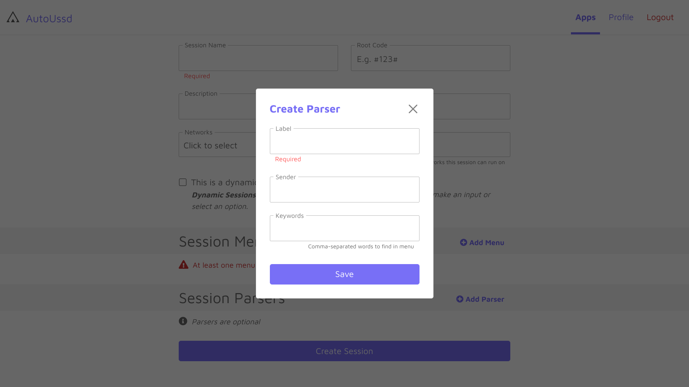

[Home](./README.md)

# SMS Parsers

Most USSD services send an SMS message afterward to notify you if whatever you did was successful, or it failed. An example is sending money via mobile money. You’ll receive an SMS indicating if the transaction was successful or it failed for some reason. (E.g. Wrong PIN, Insufficient Balance, etc.)

For the SDK to deal with such a scenario, you can add one or more **parsers** to your session in your dashboard.

When you add parsers to your session, the SDK doesn’t immediately notify your app when a session is completed. It will wait for an incoming SMS from a specified sender whose content matches the parser before invoking the callback to notify your app.

## Components of a parser

A parser structure is similar to that of a [menu](./03.Menus.md) because they both perform a similar function. You can think of a menu as a parser but for USSD content instead of SMS messages.

| Component  | Description                                                  | Example                              |
| ---------- | ------------------------------------------------------------ | ------------------------------------ |
| `Label`    | A short name for this parser                                 | *Success parser*, *Wrong PIN parser* |
| `Sender`   | The sender of the SMS message                                | *VF-CASH*                            |
| `Keywords` | An optional comma-separated list of keywords to look out for in the SMS content.   If this is specified, all keywords **must all be present** in the SMS content else the SDK will terminate with a `MENU_CONTENT_MISMATCH` error. |                                      |

## Create a parser

1. Click on the **Add parser** button
2. Fill the form with the parser details
3. Click the **Save** button to add the parser to your session

## Conclusion

Awesome. You've created your first parser within your session.

---

Back: [Menus](./03.Menus.md)    Next Up: [Branches](./05.Branches.md)
